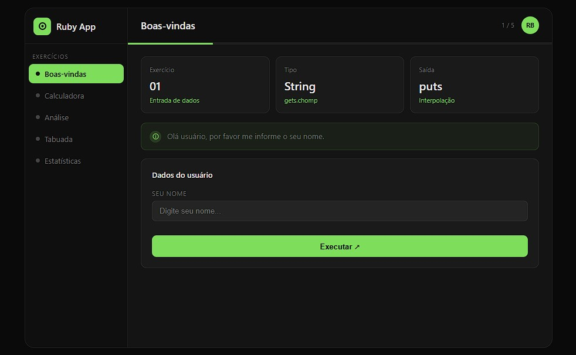

# 🟢 Atividade Ruby — Paradigmas de Programação

> **Projeto desenvolvido como atividade da disciplina de Paradigmas de Programação.**  
> Finalidade exclusivamente educacional.

Aplicação web completa que integra um **back-end em Ruby** (Sinatra) com uma **interface gráfica moderna em HTML/CSS/JavaScript**. O projeto demonstra conceitos fundamentais da linguagem Ruby através de 5 exercícios interativos.

---

## 📸 Interface



---

## 📚 Sobre o Projeto

Esta aplicação foi desenvolvida para demonstrar, na prática, os seguintes paradigmas e conceitos da linguagem Ruby:

| Exercício | Conceito Demonstrado |
|-----------|----------------------|
| 01 — Boas-vindas | Entrada/saída de dados, interpolação de strings |
| 02 — Calculadora | Operações aritméticas, tratamento de exceções |
| 03 — Análise de Número | Estruturas condicionais (`if/elsif/else`), operador módulo |
| 04 — Tabuada | Laços de repetição, intervalos, `.map` |
| 05 — Estatísticas | Arrays, `.sort`, `.sum`, média e mediana |

---

## 🏗️ Arquitetura do Projeto

```
atividade_ruby/
│
├── app.rb              # Back-end: servidor Ruby com Sinatra
├── Gemfile             # Dependências do projeto Ruby
│
└── public/
    └── index.html      # Front-end: interface visual no navegador
```

### Como as partes se comunicam

```
Usuário preenche o formulário
        ↓
  [index.html]  →  envia dados em JSON via HTTP POST
        ↓
  [app.rb]      →  valida + processa em Ruby puro
        ↓
  [app.rb]      →  responde com JSON
        ↓
  [index.html]  →  exibe o resultado na tela
```

- **Front-end** (`index.html`): coleta entradas do usuário e exibe resultados. Não faz cálculos.  
- **Back-end** (`app.rb`): recebe os dados, executa toda a lógica em Ruby e devolve o resultado.  
- **Comunicação**: HTTP + JSON usando a função `fetch` do JavaScript e as rotas `POST` do Sinatra.

---

## 🛠️ Tecnologias Utilizadas

| Tecnologia | Versão recomendada | Função |
|------------|--------------------|--------|
| Ruby | 3.2+ | Linguagem back-end |
| Sinatra | 4.x | Framework web para Ruby |
| Puma | latest | Servidor HTTP |
| Rackup | latest | Interface entre Sinatra e Puma |
| HTML5 / CSS3 / JavaScript | — | Interface visual |

---

## ✅ Pré-requisitos

Antes de começar, você precisa ter instalado no seu computador:

- **Windows 64 bits**
- **Ruby** (com RubyInstaller)
- **Visual Studio Code**
- **Conexão com a internet** (para instalar as gems)

---

## 🚀 Instalação e Execução — Passo a Passo (Windows 64 bits)

### Passo 1 — Instalar o Ruby

1. Acesse: [https://rubyinstaller.org/downloads](https://rubyinstaller.org/downloads)
2. Baixe a versão **Ruby+Devkit** recomendada (marcada com `=>`)
3. Execute o instalador
4. Na tela de opções, **marque** `Add Ruby executables to your PATH` ✅
5. Ao final da instalação, uma janela preta será aberta — digite `1` e pressione **Enter**
6. Aguarde a instalação finalizar e feche a janela

**Verifique a instalação** abrindo um terminal e digitando:
```powershell
ruby -v
```
Deve aparecer algo como: `ruby 3.x.x`

---

### Passo 2 — Baixar o Projeto

Baixe os arquivos do projeto e organize-os na seguinte estrutura de pastas:

```
atividade_ruby/         
├── app.rb
├── Gemfile
└── public/             
    └── index.html
```

> ⚠️ **Atenção:** o arquivo `index.html` deve estar **obrigatoriamente** dentro da pasta `public`. Caso contrário o servidor não vai encontrá-lo.

---

### Passo 3 — Abrir o Projeto no VS Code

1. Abra o **Visual Studio Code**
2. Vá em **File → Open Folder**
3. Selecione a pasta `atividade_ruby`
4. Abra o terminal integrado com o atalho **Ctrl + `** (acento grave)

> O terminal deve abrir já dentro da pasta `atividade_ruby`. Confirme digitando `dir` — você deve ver os arquivos `app.rb` e `Gemfile` listados.

---

### Passo 4 — Instalar as Dependências

No terminal do VS Code, execute os comandos abaixo **na ordem**:

**1. Instalar o Bundler** (gerenciador de dependências do Ruby):
```powershell
gem install bundler
```

**2. Instalar todas as gems do projeto** (Sinatra, Puma, Rackup):
```powershell
bundle install
```

Você verá uma mensagem como:
```
Bundle complete! 4 Gemfile dependencies, X gems now installed.
```

---

### Passo 5 — Iniciar o Servidor Ruby

```powershell
ruby app.rb
```

O terminal exibirá uma mensagem similar a:
```
Puma starting in single mode...
* Listening on http://127.0.0.1:4567
```

✅ O servidor Ruby está rodando.

---

### Passo 6 — Acessar a Interface no Navegador

Abra qualquer navegador (Chrome, Edge, Firefox) e acesse:

```
http://localhost:4567
```

A interface gráfica será carregada e você poderá usar a aplicação.

---

### Passo 7 — Encerrar o Servidor

Quando quiser parar a aplicação, volte ao terminal do VS Code e pressione:

```
Ctrl + C
```

---

## 🔁 Resumo dos Comandos

```powershell
# Instalar dependências (apenas na primeira vez)
gem install bundler
bundle install

# Iniciar o servidor
ruby app.rb

# Acessar no navegador
# http://localhost:4567

# Encerrar o servidor
# Ctrl + C no terminal
```

---

## 📖 Como Usar a Aplicação

1. **Acesse** `http://localhost:4567` no navegador
2. A aplicação abre no **Exercício 1 — Boas-vindas**
3. Preencha o campo solicitado e clique em **Executar**
4. Após o resultado aparecer, clique na **seta verde** para avançar ao próximo exercício
5. Complete todos os 5 exercícios em sequência
6. Ao finalizar, uma **tela de conclusão** será exibida com seu nome
7. Você pode clicar em **Reiniciar** para recomeçar ou **Fechar** para encerrar

> 💡 **Dica:** Cada exercício valida os dados antes de processar. Se você inserir um valor inválido (ex: número no campo de nome, decimal onde só aceita inteiro), uma mensagem de erro será exibida em vermelho.

---

## 🗂️ Descrição dos Arquivos

### `app.rb` — Back-end Ruby

| Rota | Método | Descrição |
|------|--------|-----------|
| `/` | GET | Serve o arquivo `index.html` |
| `/ex1` | POST | Valida nome e retorna saudação |
| `/ex2` | POST | Recebe dois inteiros e retorna as 4 operações |
| `/ex3` | POST | Analisa sinal e paridade de um número |
| `/ex4` | POST | Gera a tabuada até o limite informado |
| `/ex5` | POST | Calcula maior, menor, média e mediana de 5 números |

### `Gemfile` — Dependências

```ruby
gem 'sinatra'  # Framework web
gem 'json'     # Suporte a JSON
gem 'rackup'   # Interface entre Sinatra e o servidor
gem 'puma'     # Servidor HTTP
```

### `public/index.html` — Front-end

Interface visual com:
- Sidebar de navegação com os 5 exercícios
- Barra de progresso
- Cards informativos por exercício
- Formulários com validação
- Comunicação com o back-end via `fetch` (JavaScript)
- Tela final personalizada com o nome do usuário

---

## ⚠️ Solução de Problemas Comuns

**Erro: `ruby` não é reconhecido como comando**  
→ Feche e reabra o VS Code após instalar o Ruby. O PATH precisa ser recarregado.

**Erro: `Sinatra could not start, rackup puma not found`**  
→ Execute `bundle install` novamente. Se persistir: `gem install rackup puma`

**Erro: `bundle` não é reconhecido**  
→ Execute `gem install bundler` primeiro, depois `bundle install`

**A página não abre no navegador**  
→ Verifique se o terminal mostra `Listening on http://127.0.0.1:4567`  
→ Confirme que está acessando `http://localhost:4567` (não `https`)

**Página abre em branco**  
→ Verifique se o arquivo `index.html` está dentro da pasta `public/`

---

## 👨‍🎓 Contexto Acadêmico

| Campo | Informação |
|-------|-----------|
| Disciplina | Paradigmas de Programação |
| Finalidade | Atividade avaliativa |
| Linguagem principal | Ruby |
| Paradigma demonstrado | Imperativo / Orientado a Objetos |

---

## 📄 Licença

Projeto desenvolvido para fins **exclusivamente educacionais**.  
Livre para uso, estudo e modificação com fins acadêmicos.
